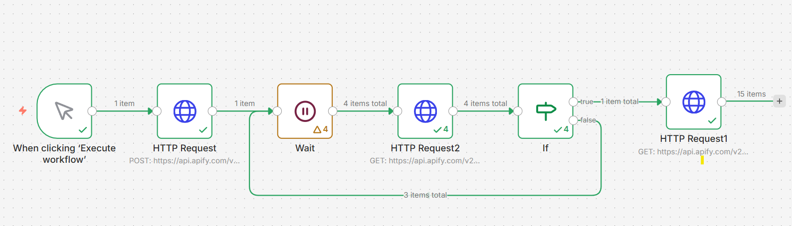

# 🚀 Google Maps Scraper Automation (Apify + n8n)

This project demonstrates how to automate Google Maps data scraping using **Apify** and **n8n**.

## 🔥 Features

- Trigger Apify actor via API
- Wait for scraping completion
- Fetch structured data from dataset
- Fully automated workflow using n8n
- No manual scraping required

---

## 🧠 Workflow Overview

1. Trigger workflow manually or via webhook
2. Send POST request to Apify actor
3. Wait for execution to complete
4. Fetch dataset results using dataset ID
5. Process results in n8n

---

## ⚙️ Tech Stack

- n8n (workflow automation)
- Apify (Google Maps Scraper)
- HTTP API
- JSON data processing

---

## 📸 Example Use Cases

- Lead generation
- Local business data collection
- Market research
- Competitor analysis

---

## 🔑 Setup Instructions

1. Clone the repository
2. Import the n8n workflow JSON
3. Add your Apify API token
4. Customize search queries
5. Run the workflow

---

## ⚠️ Notes

- Do not expose your API token publicly
- Respect Google Maps data usage policies

---

## 💡 Example Input

```json
{
  "searchStringsArray": ["restaurant in New York"],
  "maxCrawledPlacesPerSearch": 5
}
## 📸 Workflow Screenshot


